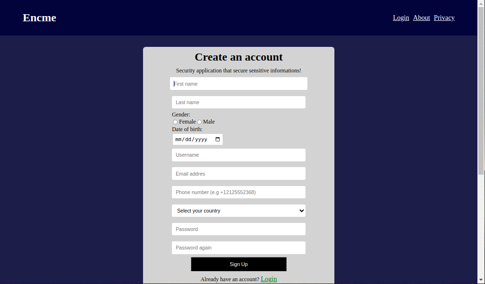
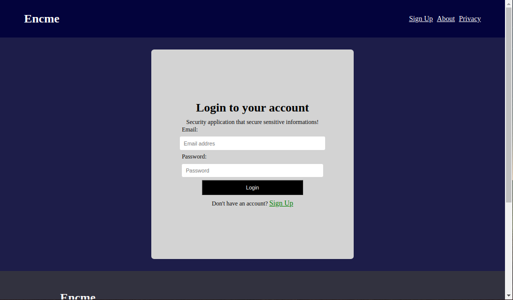
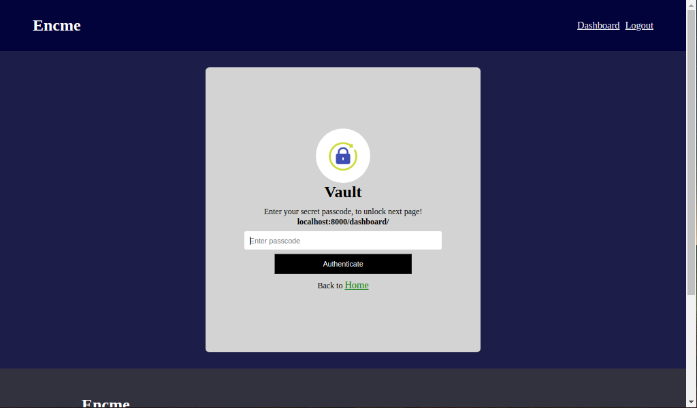
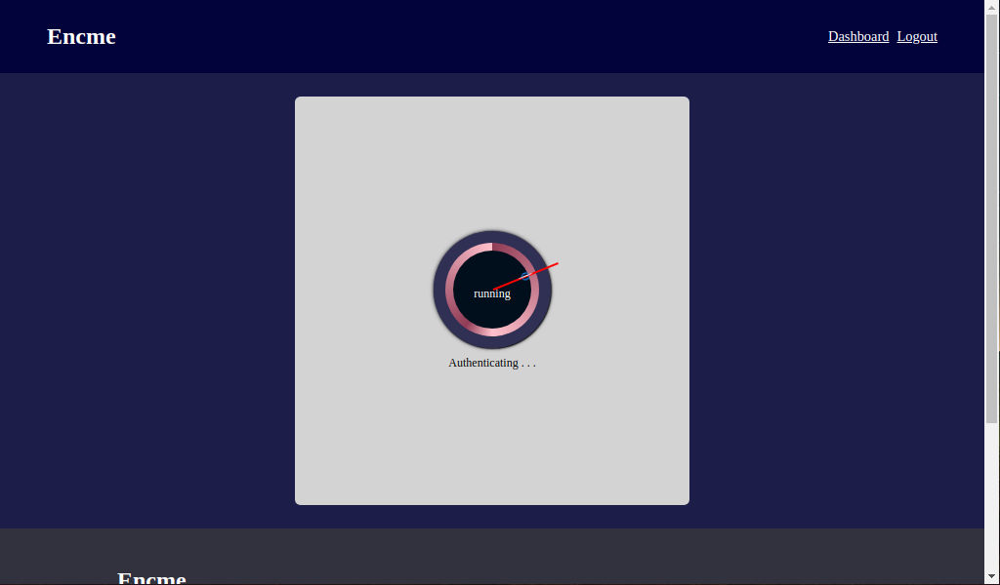
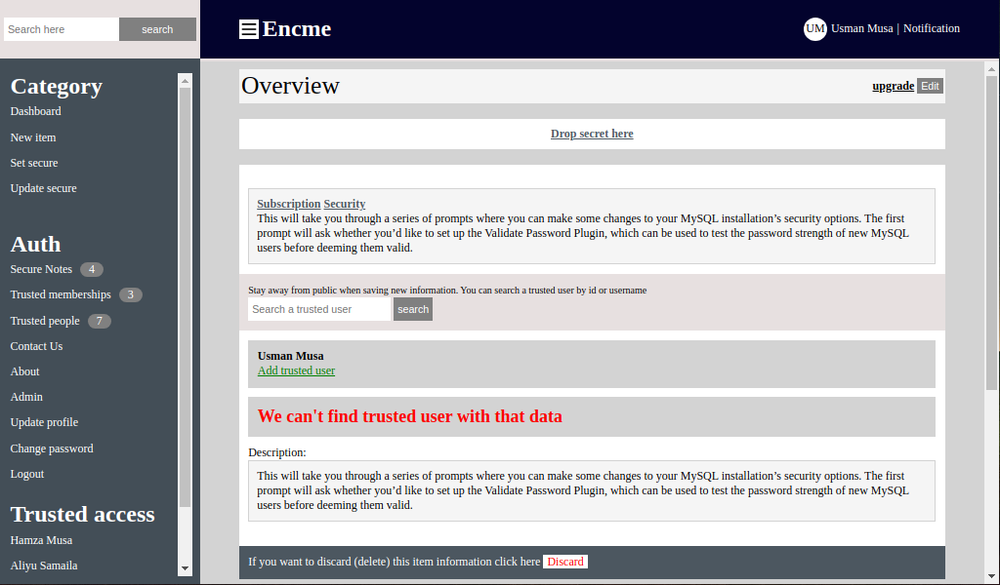

# Encme

A password and sensitive information manager, that encrypt and save them for a user, which can be decrypt by the use when ever need to be. A security application that secure sensitive informations.

