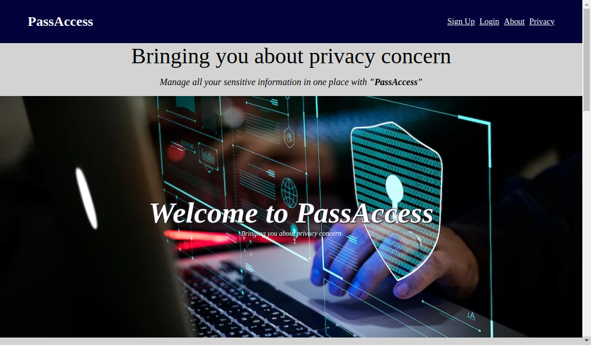

# PassAccess

Password and sensitive information manager, that encrypt and save them for a user, which can be decrypt by the user when ever need to be. Security application that secure sensitive informations.



## Usage

First clone the repository

```sh
git clone https://github.com/usmanmusa1920/pass-access
```

Enter into the directory

```sh
cd pass-access
```

Create virtual environment

```sh
python -m venv p_venv
```

Activate virtual environment

```sh
source p_venv/bin/activate
```

Install requirements

```sh
pip install -r requirements.txt
```

Now run the development server by:

```sh
python manage.py runserver
```

Visit the url address `http://localhost:8000`, use any of the below users credential to login!

**Email:** usmanmusa1920@gmail.com **Password:** passwd123

**Email:** aliyumuhammad@gmail.com **Password:** passwd123

**Email:** fatimasani@gmail.com **Password:** passwd123

**Email:** ahmadaminu@gmail.com **Password:** passwd123

**Email:** johnchristain@gmail.com **Password:** passwd123

**Email:** nuraali@gmail.com **Password:** passwd123

**Email:** zainabmusa@gmail.com **Password:** passwd123

**Email:** adamunmusa@gmail.com **Password:** passwd123

**Email:** maryamyusuf@gmail.com **Password:** passwd123

**Email:** joshuaandy@gmail.com **Password:** passwd123

Pull requests are welcome
