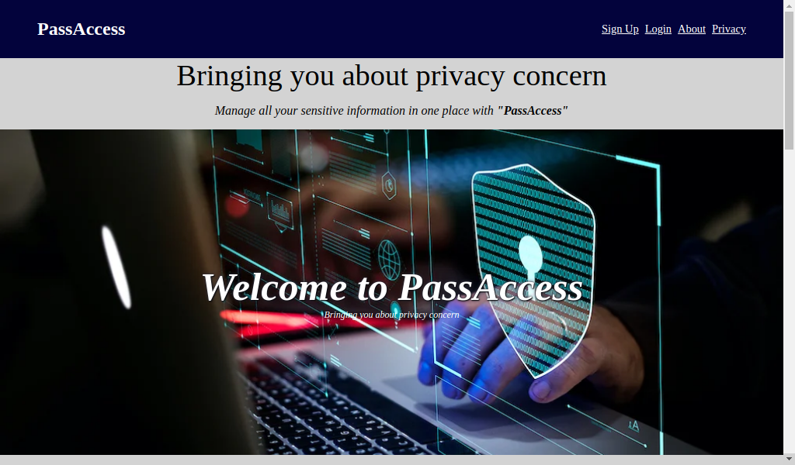

# PassAccess

Password and sensitive information manager, that encrypt and save them for a user, which can be decrypt by the user when ever need to be! it is a security application that secure sensitive informations.

## Intro

Good day, I`m Usman Musa 3MTT fellow under software development. My Fellow ID is FE/24/7682377911

Here is my knowledge showcase project, which is called **PassAccess** a security application, of password and sensitive information manager, that encrypt and save data for a user, which can be decrypt by the user when ever need to be! using a good cryptographical hashing algorithm.

In this application once you signup, you will be redirected to login page. For ease of testing, you can login using the pre-registered user credentials, which are available in the `help page` of the application.

Once you login for the first time it will ask you to create a `passcode` along-side with `lucky number` and `childhood name` as `MFA (Multi Factor Authenticator)`. After every `1 minute` the passcode will be required, but you can increase the timeout from the default `1 minute` up-to `30 minutes` in the profile update page.

The `MFA (Multi Factor Authenticator)` which are `lucky number` and `childhood name` will be use after trying 5 invalid `passcode` for security reason.

Now let create an item and see

Thank you!

## What it is?

In this application once you signup, you will be redirected to login page in other to log in.

Once logged in for the first time you will be asked to set a `passcode` (master password), the `passcode` will be used frequently within the application, when ever it session expired.

The passcode will be used when you want to `(generate strong password, update profile, change password, change passcode, add new item, view item, search trusted user, add trusted user, remove trusted user, remove all trusted user, delete item, and even the dashboard/landing page)`.

By default the passcode session age is set to 1 minutes, but a user can set it more-than that but less-than or equal-to 30 minutes.

In the application there is a sleep mode (dim), this will make the window of the application to be navy blue in color (making everything color and background navy), onces nothing is done within a range of 1 minute. User can disable this functionality for his account. It is included to make anything in the page not to appear, to who so ever around if the account owner is busy about something.



## Usage

First clone the repository

```sh
git clone https://github.com/cheapvtudata@gmail.com/pass-access
```

Enter into the directory

```sh
cd pass-access
```

Create virtual environment

```sh
python -m venv p_venv
```

Activate virtual environment

```sh
source p_venv/bin/activate
```

Install requirements

```sh
pip install -r requirements.txt
```

Now run the development server by:

```sh
python manage.py runserver
```

Visit the url address `http://localhost:8000`, use any of the below users credential to login!

**Email:** usmanmt@mail.com **Password:** passwd123

**Email:** aliyumuhammad@mail.com **Password:** passwd123

**Email:** fatimasani@mail.com **Password:** passwd123

**Email:** ahmadaminu@mail.com **Password:** passwd123

**Email:** johnchristain@mail.com **Password:** passwd123

**Email:** nuraali@mail.com **Password:** passwd123

**Email:** zainabmusa@mail.com **Password:** passwd123

**Email:** adamunmusa@mail.com **Password:** passwd123

**Email:** maryamyusuf@mail.com **Password:** passwd123

**Email:** joshuaandy@mail.com **Password:** passwd123

💻 Pull requests are welcome
